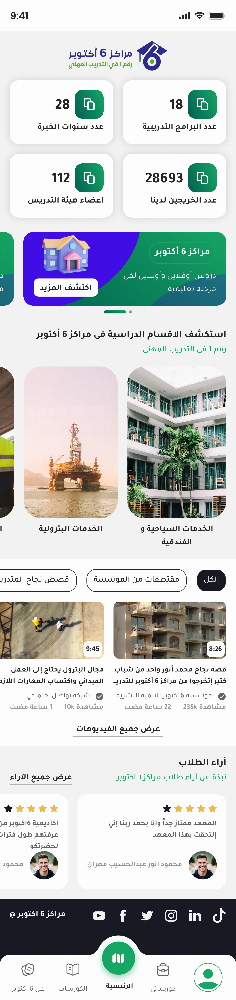
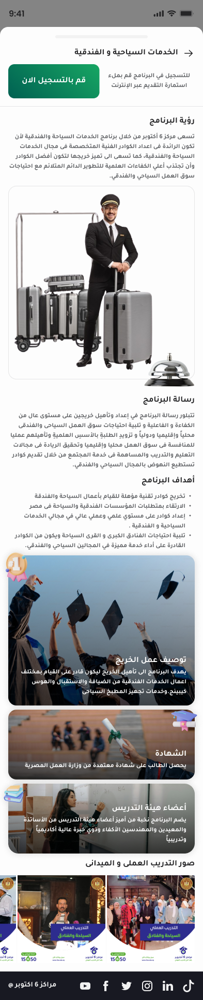

# October6 E-Learning App

A scalable, high-performance e-learning mobile application built with Flutter for Android and iOS. October6 connects students and instructors with seamless course delivery, real-time communication, and secure data handling.

---

## 🚀 Demo Video

[![Watch the Demo]](https://vimeo.com/1082519941/aac489d09d?share=copy)

---

## 📸 Screenshots

| Home Screen | Course Detail |           Settings           |
|:-----------:|:-------------:|:----------------------------:|
|  |  |  |

---

## ✨ Features

### Core Functionality

- Access and browse course content  
- Watch educational videos  
- Download and share learning materials  
- View questions and communicate directly with instructors

### Highlights

- Architected with Clean Architecture and Bloc state management  
- Enabled students to browse courses, watch videos, download materials, and ask instructors questions  
- Integrated secure data handling and authentication  
- Optimized UI for user engagement and accessibility

### Technical Features

- **Clean Architecture** with layered project structure 
- **State Management** using Bloc (Cubit) for predictable state flow  
- **Security** secure local storage & secure baseUrls and any api key 
- **Media Streaming** for video lessons and downloadable resources  
- **Responsive UI** optimized for various screen sizes and orientations

---

## 🛠️ Technologies

- **Language & Framework:** Dart, Flutter
- **State Management:** Bloc (Cubit)
- **Architecture:** Clean Architecture, SOLID Principles
- **Tools:** Git, GitHub CI/CD

